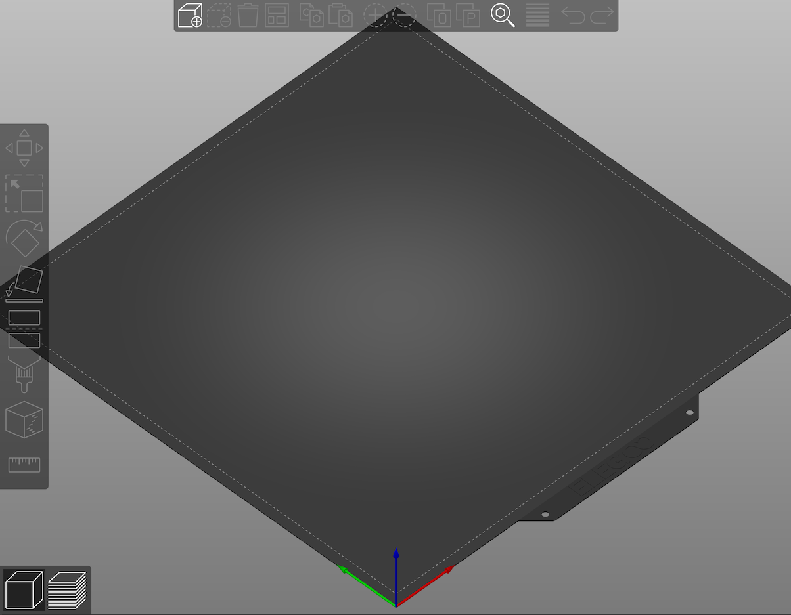

# Elegoo Neptune 3 Pro profiles for use with PrusaSlicer

I'm sharing my profile for using my stock Elegoo Neptune 3 Pro with PrusaSlicer. This profile is compatible with the following machines:

- Elegoo Neptune 3 Pro
- Elegoo Neptune 3 Plus
- Elegoo Neptune 3 Max

The profile was tuned with the following priorities:

1. Use the stock values from the official firmware
2. Keep the same printing quality as the Elegoo Cura profile
3. Keep the same printing speed as a Prusa i3 MK3

To tune this profile I examined many of my prints and did a extruder flow test and determined that 12 mm³/s was the highest value it could achieve without underextrusion for my PLA at 210ºC.

It should print a 0.2mm layer height benchy with 20% rectilinear infill and 2 walls in about one hour.

It also aims to have a very nice starting/ending Gcode.

# How to install

## Method A

I'm assuming you have:

- The latest [PrusaSlicer](https://github.com/prusa3d/PrusaSlicer/releases) installed
- You have configured it with the Neptune 3 Pro/Plus/Max with the stock settings

1. Open **PrusaSlicer** on the **Help** menu, then **Show Configuration Folder**.

2. Quit PrusaSlicer and go back to the **file manager**.

3. Open the `vendor` subfolder.

4. Download the lastest [release](https://github.com/RuiNelson/Neptune3ProProfileForPrusaSlicer/releases) from GitHub.

5. Unzip my files to your `vendor` subfolder. If necessary, replace the files there.

## Method B

1. Run PrusaSlicer for the first time if you haven't already.
2. Quit out of the configuration wizard without adding a printer and exit PrusaSlicer.
3. Run `stow printer`
4. Restart PrusaSlicer and run the configuration wizard.
5. Add the Elegoo Neptune 3 Pro from the list.

Finished! Reopen PursaSlicer to get the new configuration loaded, you should see something like this for the bed of your printer:

